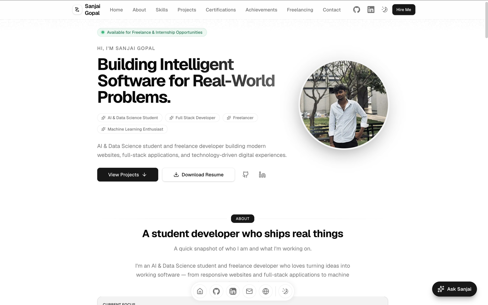

<div align="center">

# Sanjai Gopal — Portfolio

### Modern personal portfolio built with Next.js, Magic UI and Framer Motion.

[](https://sanjai-alpha.vercel.app/)

</div>

---

## Preview



---

## ✦ About the Website

A modern, responsive personal portfolio designed to showcase projects, skills, certifications, achievements, freelance services, and an AI-powered portfolio assistant through an interactive and lightweight experience.

---

## ✨ Features

- Modern responsive design
- Light / dark theme
- Magic UI components
- Framer Motion animations
- Smooth scrolling and micro-interactions
- Interactive project showcase
- Certifications and achievements sections
- Freelancing section
- Resume download
- GitHub and LinkedIn integration
- **Ask Sanjai** AI chatbot
- Mobile-friendly layout
- SEO and performance optimized

---

## 🛠 Tech Stack

`Next.js` · `React` · `TypeScript` · `Tailwind CSS`  
`Magic UI` · `shadcn/ui` · `Framer Motion`  
`Vercel` · `Hugging Face`

---

## 🚀 Run Locally

```bash
git clone https://github.com/Sanjai-Gopal/sanjai-dev.git
cd sanjai-dev
npm install
npm run dev
